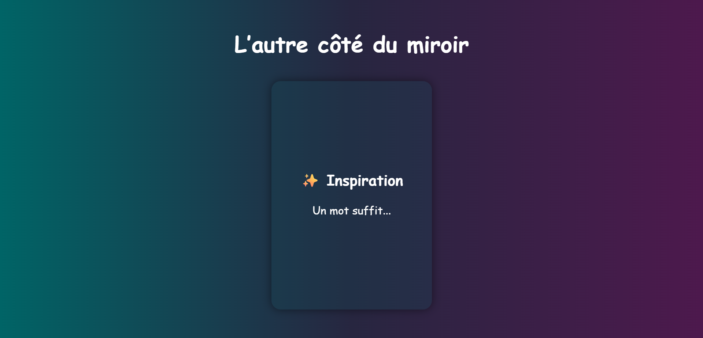
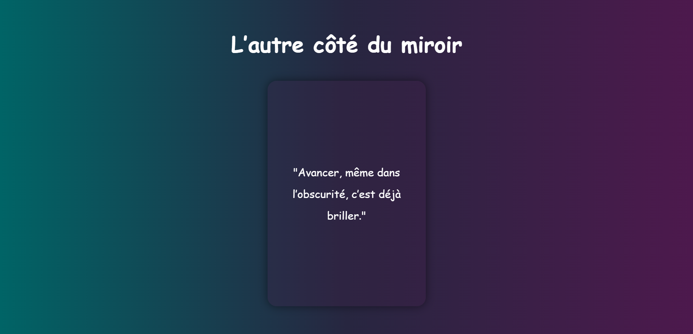

# 🌌 FlipCard Project

Un petit projet d’entraînement au **Flip Card** (carte qui se retourne) en HTML, CSS et JavaScript.  
Ce projet affiche une **carte interactive** qui se retourne avec un effet 3D et un **effet sonore**.

---

## 🚀 Live Demo

👉 [Voir la page en ligne](https://anya-git.github.io/FlipCard/)

---

## 📂 Repository

👉 [Accéder au repo GitHub](https://github.com/AnYa-git/FlipCard.git)

---

## ✨ Aperçu

- Effet **flip 3D** avec `transform` et `backface-visibility`
- Ajout d’un **effet sonore** lors du retournement
- Fond avec **dégradé moderne **

---

## 🛠️ Technologies utilisées

- **HTML5**
- **CSS3** (Flexbox, animations 3D)
- **JavaScript** (événements & audio)

---

## 📸 Screenshots

### Face avant

### Face arrière

---

## 📚 Objectif

Apprentissage et pratique des bases du **CSS 3D** et de l’interactivité en JavaScript :

- Gestion de la perspective et des animations en 3D  
- Utilisation de `hover` et d’événements JS  
- Intégration d’un effet sonore dans une interaction utilisateur  

---

✍️ Créé avec ❤️ par **Anya**
